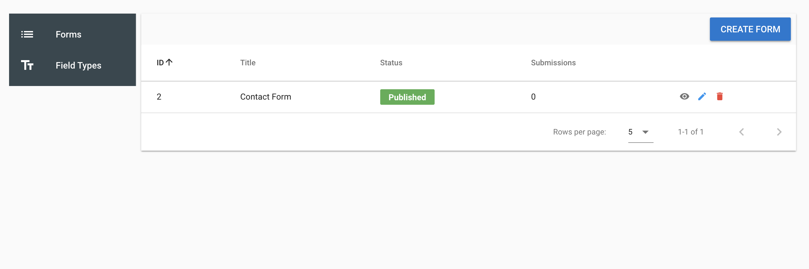
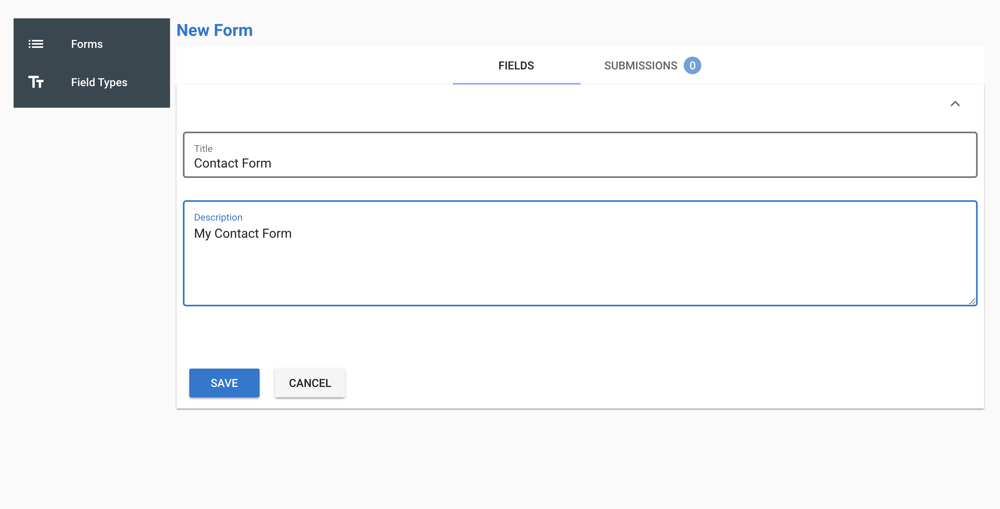
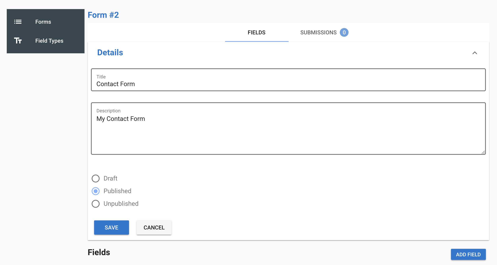
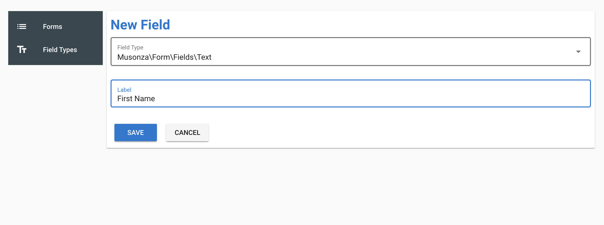
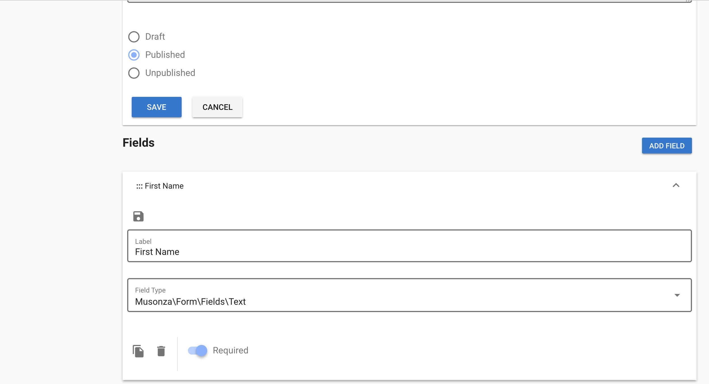
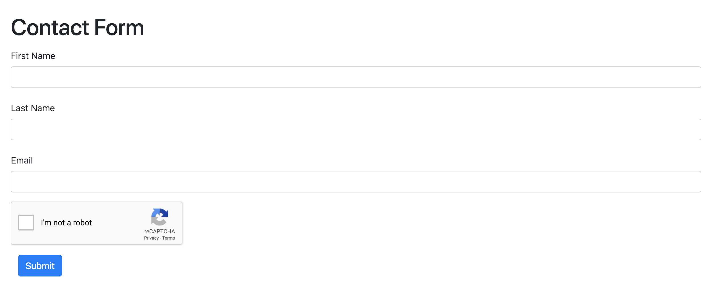
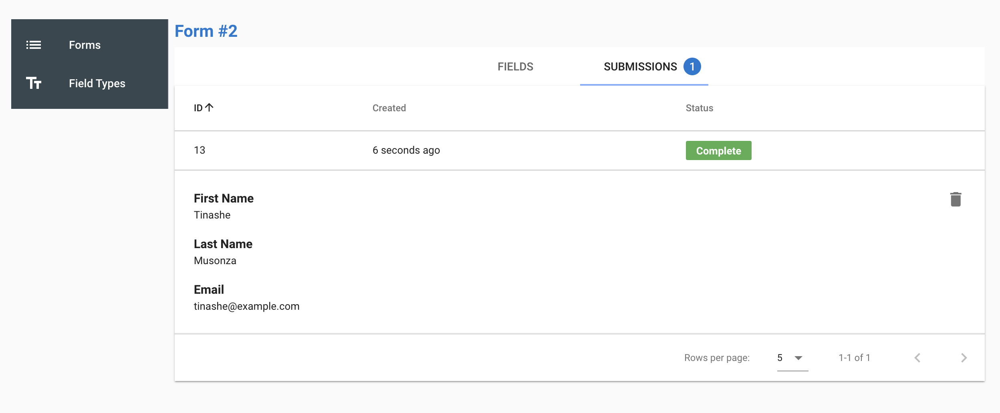

# Laravel Forms

[](https://travis-ci.org/musonza/laravel-forms)
[](https://packagist.org/packages/musonza/laravel-forms)



## Installation
1. Install composer package
    ```sh
    composer require musonza/laravel-forms
    ```

1. Publish Assets
    ```sh
    php artisan vendor:publish
    ```
1. Add Form facade to `config/app.php`
    ```php
    'Form' => Musonza\Form\Facades\FormFacade::class,
    ```
    
1. Run migrations
    ```sh
    php artisan migrate
    ```  

1. Check the published file config/laravel_forms.php
    - You can enable / disable captcha
    - You can configure the path for your forms dashboard
    - You can add custom field types
    
1. Access dashboard at

    http//your-url.com/laravel-forms (you can change the path in config/laravel_forms.php)

## Adding a Form


## Form details


## Adding a Field


## Field details


## Sample Form Output


## Sample Submission


## TODO
- Multi page forms

## Credits
https://github.com/laravel/telescope for some of the front-end structuring 
